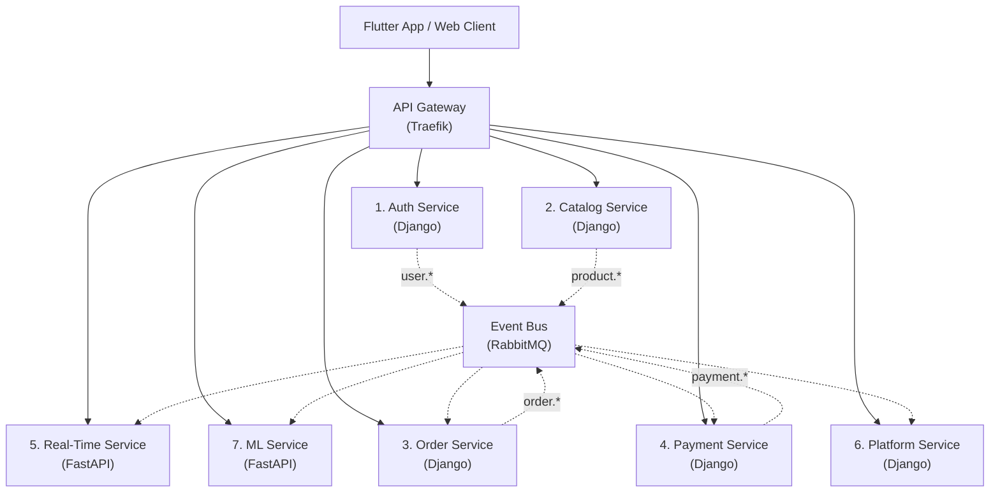

# Microservices Architecture

```mermaid
graph TB
    CLIENT["Flutter App / Web Client"]
    GW["API Gateway<br/>(Traefik)"]
    
    CLIENT --> GW
    
    GW --> AUTH["1. Auth Service<br/>(Django)"]
    GW --> CATALOG["2. Catalog Service<br/>(Django)"]
    GW --> ORDER["3. Order Service<br/>(Django)"]
    GW --> PAY["4. Payment Service<br/>(Django)"]
    GW --> RT["5. Real-Time Service<br/>(FastAPI)"]
    GW --> PLATFORM["6. Platform Service<br/>(Django)"]
    GW --> ML["7. ML Service<br/>(FastAPI)"]
    
    BUS["Event Bus<br/>(RabbitMQ)"]
    
    AUTH -.->|user.*| BUS
    CATALOG -.->|product.*| BUS
    ORDER -.->|order.*| BUS
    PAY -.->|payment.*| BUS
    
    BUS -.-> RT
    BUS -.-> ML
    BUS -.-> ORDER
    BUS -.-> PAY
    BUS -.-> PLATFORM
```
